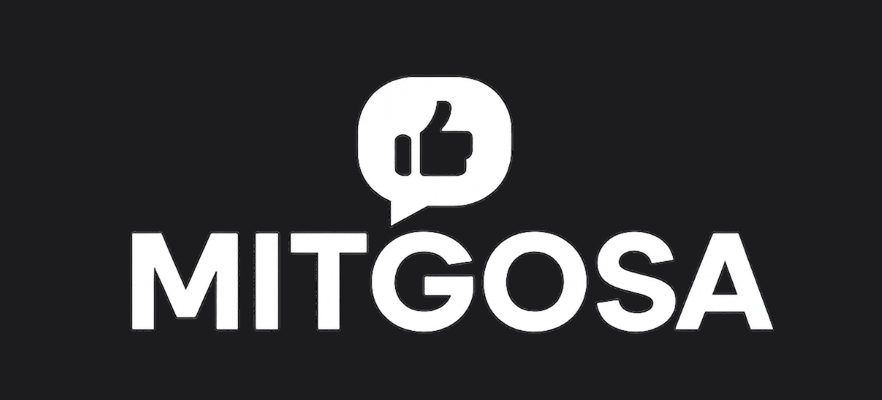
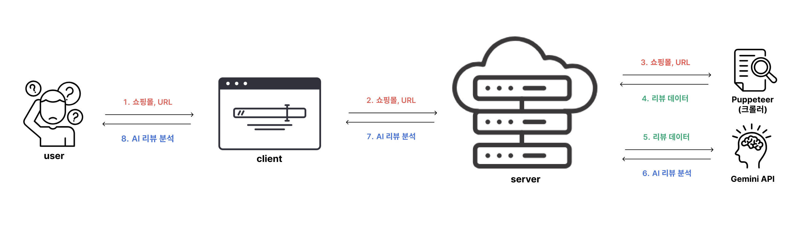
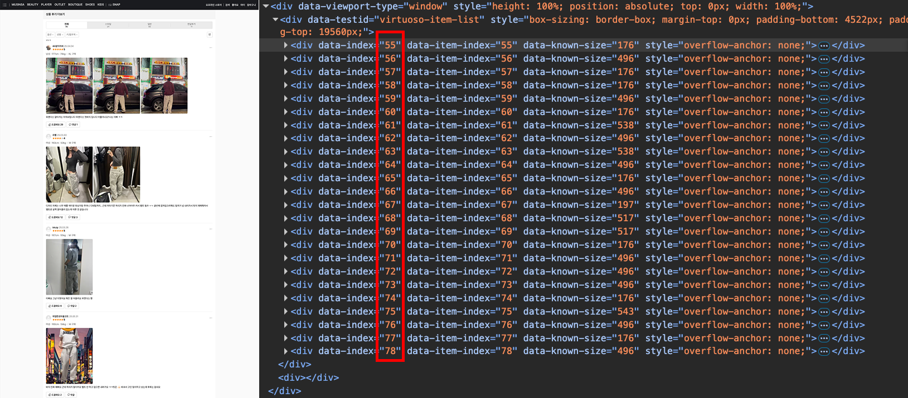
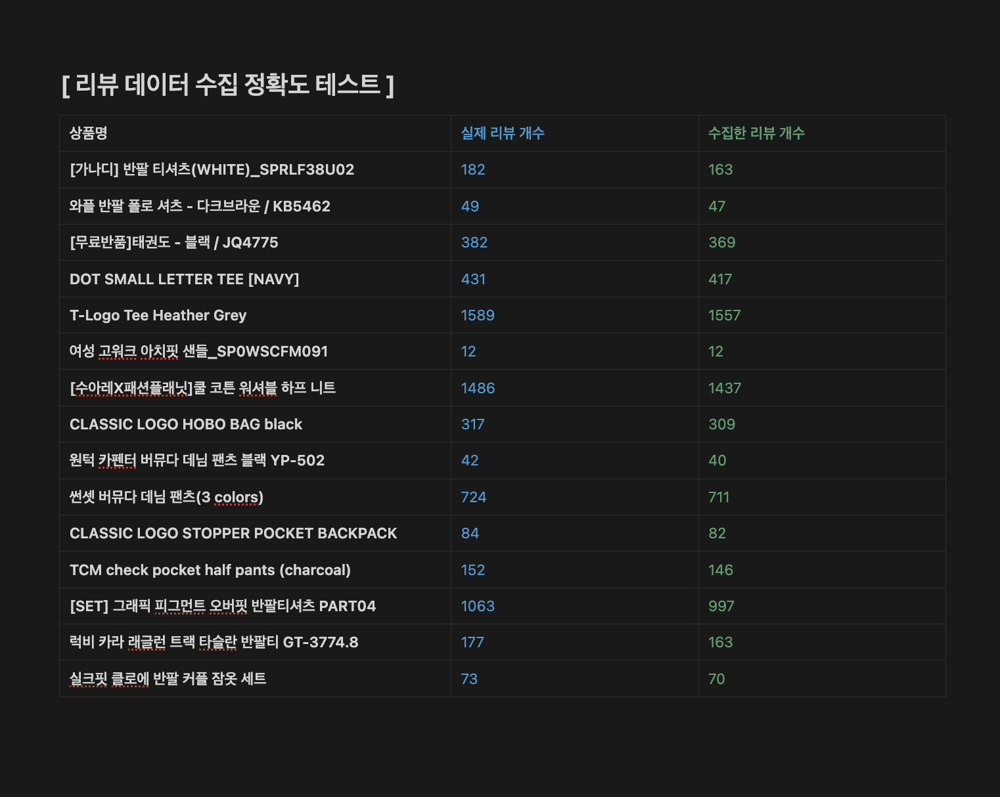
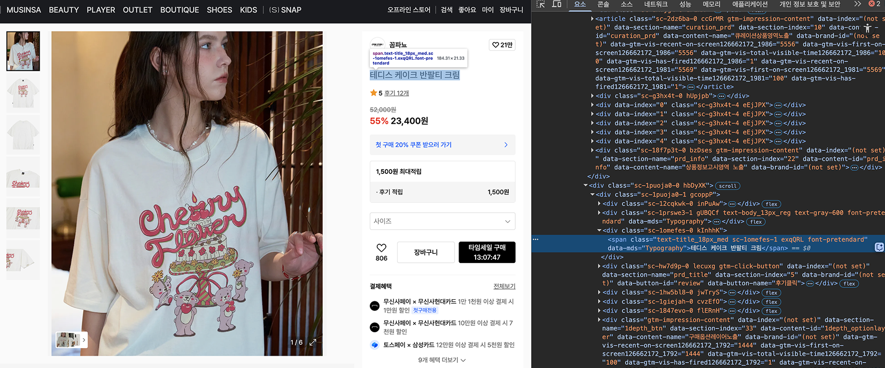

# MITGOSA(믿고사) - AI 리뷰 요약 서비스

<br />
<br />

<p align="center">

</p>

<p align="center">
  <strong>
  MITGOSA는 수많은 리뷰를 보며 많은 시간을 보내는 사람들을 위해, <br>원하는 상품의 전체 리뷰를 AI가 분석하여 한눈에 요약해주는 서비스입니다.
  </strong>
<br>
<a href="https://mitgosa.vercel.app">
    🔗 [https://mitgosa.vercel.app] 방문하기
</a>

<br />
<br />
<br />

# 🗂 목차

1. [💭 프로젝트 동기](#-프로젝트-동기)
2. [🛠 사용 기술](#-사용-기술)
3. [👀 미리보기 및 아키텍처](#-미리보기-및-아키텍처)
4. [🔥 주요 경험](#-주요-경험)
5. [💡 프로젝트 후기](#-프로젝트-후기)

<br />
<br />
<br />

# 💭 프로젝트 동기

이 프로젝트는 **인터넷 쇼핑을 좀 더 빠르고 편리하게** 돕고자 하는 생각에서 출발하였습니다.

온라인 마켓을 통해 쇼핑하며, 신뢰할 수 있는 정보를 얻기 위해 **수많은 리뷰를 하나하나 읽는 과정의 불편함**을 느꼈습니다. 저와 같은 사람들을 위해,<br /> 크롤링하여 얻은 리뷰 데이터를 **AI가 요약하고 정리**해줌으로써 사용자의 **시간과 노력을 획기적으로 절약**할 수 있을 것이라는 확신을 가지고 이 프로젝트를 시작하게 되었습니다.

저의 필요에서 비롯된 아이디어이기에 더 큰 애정을 가지고 개발에 임했으며, 그 속에 **기술적 도전을** 하나하나 달성하며 흥미를 느낄 수 있었습니다.

<br />
<br />
<br />

# 🛠 사용 기술

| 구분              | 기술                                                                                                                                                                                                                                                                                                                                                                                                            |
| ----------------- | --------------------------------------------------------------------------------------------------------------------------------------------------------------------------------------------------------------------------------------------------------------------------------------------------------------------------------------------------------------------------------------------------------------- |
| **Frontend**      |      |
| **Backend**       |                                                                                                                                                                                                     |

<br />
<br />
<br />

  # 👀 미리보기 및 아키텍처
  
  <table>
    <tr align="center">
      <td>리뷰 분석</td>
      <td>UI / UX</td>
    </tr>
    <tr>
       <td width="50%">
        
      </td>
      <td width="50%">
        
      </td>
    </tr>
  </table>

  ---
  
  

---

1.  **상품페이지 URL 수집:** 사용자가 상품 URL을 입력하면, 이를 서버로 전송합니다.
2.  **웹 크롤링:** 전달받은 URL을 `Puppeteer`를 이용해 크롤링하여 쇼핑몰의 리뷰 데이터를 수집합니다.
3.  **AI 리뷰 분석:** `Google Gemini API`를 활용하여 수집된 수백, 수천 개의 리뷰 텍스트를 분석하고 핵심적인 장점과 단점을 추출합니다.
4.  **Rest API 응답:** 분석된 결과(장점, 단점, 요약 등)를 클라이언트로 전달합니다.
5.  **분석 결과 시각화:** 분석된 결과를 바탕으로 상품의 장점, 단점, 종합 평점, 추천 대상까지 한눈에 보기 쉽게 제공합니다.

<br />

> **요약: 상품 URL 수집 >>>>>> 해당 상품의 리뷰 분석 결과 제공**

<br />
<br />
<br />

# 🔥 주요 경험

## [주요경험] 1. 크롤링을 사용한 필수 데이터 확보

> 크롤링(Crawling) = 웹 페이지의 데이터를 자동으로 가져오는 기술

이 프로젝트에서 중요한 데이터는 해당 상품의 리뷰 데이터와 상품 정보(상품명, 가격, 이미지 등) 입니다. <br />
때문에, 이 2가지 데이터를 가져오는 방법에 대한 고민을 가장 먼저 시작했고 크롤링을 사용해 데이터를 가져왔습니다.

---

#### 1-1. 크롤링 사용 이유 : 오픈 API의 부재

웹 페이지 데이터를 활용하는 프로젝트 특성상 오픈 API 사용을 최우선으로 고려했습니다.<br />
그러나 무신사, 에이블리 등의 쇼핑몰 사이트는 오픈 API를 제공하지 않아 크롤링 도입이 필요하다고 판단했습니다.

오픈 API와 크롤링을 비교할 때 가장 중요한 차이점은 **데이터의 신뢰성**입니다. 공식적으로 제공되는 데이터가 아니기 때문에 신뢰성 검증이 필요했습니다.

> **신뢰성의 기준은 크롤링으로 수집한 리뷰 데이터의 개수가 실제 총 리뷰 개수와 얼마나 일치하는지로 설정했습니다.**


---

#### 1-2. 가상 스크롤 크롤링 문제 : Puppeteer의 기능을 활용한 단계적 스크롤 로직 구현

초기에 크롤링 로직으로 리뷰를 수집한 결과, 10-20개 정도 소수의 리뷰만 수집되는 문제가 발생했습니다. <br />
개발자 도구를 분석한 결과, 초기에 예상했던 무한스크롤 방식이 아닌 **가상 스크롤(Virtual Scroll) 방식**으로 리뷰를 렌더링하고 있었습니다.

> **가상 스크롤: 사용자가 스크롤할 때마다 새로운 데이터를 동적으로 로드하는 방식.**



무신사의 경우 순차적으로 한 번에 20-25개 정도의 리뷰만 렌더링됩니다. 이는 한 번의 크롤링으로 모든 리뷰를 수집할 수 없음을 의미했습니다.
<br /> 따라서 `page.waitForSelector()`와 `page.evaluate()`메서드를 활용하여 **단계적 스크롤 → 로딩 대기 → 데이터 수집**을 반복하였습니다.

이 후, 실제 리뷰 총 개수 대비 약 95-98%의 리뷰를 성공적으로 수집할 수 있었습니다.
<br />소량의 누락은 네트워크 지연이나 동적 로딩 타이밍 이슈로 인한 것으로 생각되었으나, 분석 속도와의 균형을 고려하여 만족할 만한 결과라고 판단했습니다.
 
다음은 위 내용을 토대로 진행한 테스트의 결과입니다.

<details>
<summary>[ 수집률 테스트 ]</summary>



</details>

---

#### 1-3. 상품의 기본 정보 크롤링

리뷰 데이터 수집에 앞서 상품 페이지에서 기본 정보를 수집하는 과정이 필요했습니다.
<br />페이지의 DOM 구조를 분석한 결과, 각 상품 정보 요소들이 고유한 CSS Selector를 가지고 있음을 확인했습니다.



위 이미지의 빨간색으로 표시된 부분은 상품명이 담긴 `span` 태그의 class 속성을 보여줍니다. 이와 같은 고유 선택자를 활용하여 상품명, 브랜드, 가격, 대표 이미지 총 4개의 핵심 정보를 안정적으로 수집할 수 있었습니다.

<details>
<summary>[ 코드 ]</summary>


</details>


```javascript
const productInfo = await page.evaluate((url) => {
      // 상품명
      const name =
        document.querySelector(
            ".text-title_18px_med.sc-1omefes-1.exqQRL.font-pretendard"
          )
          ?.textContent?.trim() || "";
      // 브랜드
      const brand =
        document.querySelector(
            '.sc-12cqkwk-2.hgzZM .text-body_14px_med.font-pretendard[data-mds="Typography"]'
          )
          ?.textContent?.trim() || "";
      // ...나머지
  return { name, brand, price, image };
});
```

<br/>
<br/>
<br/>

## [주요경험] 2. Gemini API 프롬프트를 설계와 응답 데이터 관리

이 프로젝트에서는 필요한 데이터의 종류에 따라 서로 다른 API 요청을 서버에 전송합니다. 초기 개발 시에는 대부분의 기능을 메인페이지에서 구성하고, 몇 가지 모달을 사용한 UI를 구성했기에 전역 상태 관리를 사용하지 않은 로직을 작성했습니다. 그러나 프로젝트를 진행함에 따라 전역 상태 관리의 필요성을 느끼기 시작했습니다.

### 1. 길어지는 메인페이지의 코드 : 컴포넌트의 관심사 분리

대부분의 기능이 실행되는 메인페이지 코드의 길이는 프로젝트가 진행됨에 따라 점점 길어졌습니다. 늘어난 코드의 길이를 줄여 유지보수성을 향상하고 싶다는 생각, 메인 페이지는 동영상 재생 및 조작의 기능만 담당하는 관심사의 분리를 실현해 보고 싶다는 생각으로 API 요청 함수를 별도 파일로 분리하여 관리했습니다.  
하지만, 이 방식 역시 개선이 필요해 보였습니다.

<table>
  <div align="center">전역 상태 도입 전후 메인페이지 길이 비교</div>
  <tr>
    <td width="50%">
      
    </td>
    <td width="50%">
      
    </td>
  </tr>
  <tr align="center">
    <td>로직 분리 전</td>
    <td>로직 분리 후</td>
  </tr>
</table>

> 분리 전후 약 100여줄 이상의 차이

---

<strong> 1-1. 다양한 API 요청 시점의 자동화 </strong>

다양한 API 요청 함수의 동작을 매번 명시적인 사용자 상호작용을 통하여 구현한다면 사용자 경험이 저하되고, 더하여 의도치 않은 중복 요청을 발생시킬 위험성이 존재할지도 모른다고 판단했습니다. 이러한 문제점을 해결하고자 API 요청을 상태 변화에 따라 자동으로 발생하도록 개선했습니다.  
다양한 API 요청 자동화의 트리거가 되는 값은 요청의 응답 데이터를 저장한 상태 값들이고, 해당 값들은 항상 일관된 상태를 갖기를 원했습니다. 이러한 개선 사항을 실현하기 위해 전역 상태 관리를 사용했습니다.

Zustand 전역 상태 관리 라이브러리를 도입한 후 개선된 사항은 다음과 같았습니다.

1. 응답 데이터로 받은 값을 전역 상태로 관리  
   이를 통하여 요청 자동화의 트리거가 되는 상태 값의 통일성과 신뢰성을 확보했습니다.
1. 전역 상태를 트리거로 한 API 요청의 자동화  
   다양한 시점에 필요한 API 요청의 자동화를 통하여, 사용자에게 별도의 동작을 요구하지 않고, 필요한 데이터를 반환받을 수 있게 되었습니다.

---

### 1. 초기 UI 구성 : 동영상의 총 개수 활용

프로그레스바에 총 동영상의 개수를 바탕으로 한 개별 동영상 개수를 표기했습니다.
배열을 활용하여 100%의 비율을 총 동영상의 개수로 나누었습니다. 이 값을 바탕으로 각 카페의 동영상 개수별로 또 추가되는 동영상의 개수를 반영한 UI 를 구성할 수 있었습니다.

배열 내 저장되어 있는 동영상의 위치를 이동할 경우 인덱스를 활용하여 이전의 동영상은 100% 진행률을 채운 상태로, 현재 및 이후의 동영상에 대해서는 0%의 진행률을 유지한 상태를 구현했습니다.


---

### 2. 진행률 표현 : 차오르는 애니메이션 구현

현재 동영상의 진행률을 표현할 때, HTML5의 video 태그를 사용하여 프로그레스바가 차오르는 듯한 애니메이션을 다음과 같이 구현했습니다.

<strong> 2-1. useRef 와 video 태그를 활용한 재생 길이의 퍼센트 변환 </strong>

진행률을 실시간으로 표기하기 위해서는 영상의 재생 길이를 알아내야 했습니다. 동영상과 관련된 정보는 HTMLMediaElement의 속성을 사용하여 얻을 수 있습니다. 현재 영상 시간을 제공해 주는 `currentTime` 과 영상의 총길이를 제공해 주는 `duration` 속성을 활용했습니다. 해당 속성값들을 토대로 길이를 퍼센트로 변환하는 함수를 작성했습니다.
`(currentTime / duration) * 100` 이와 같은 간단한 수식을 통해서 현재 영상의 진행률을 얻어낼 수 있었습니다.

---

<strong> 2-2. timeupdate 이벤트를 활용한 애니메이션화 </strong>

동영상의 재생 상태 즉, 진행률이 변화할 때마다 프로그레스바를 자동으로 업데이트하기 위해 `timeupdate` 이벤트를 활용했습니다. 해당 이벤트는 동영상이 재생될 때마다 호출됩니다. 이를 통해 위에서 구한 진행률을 실시간으로 갱신시킬 수 있었습니다.  
이렇게 실시간으로 업데이트되는 진행률을 사용하여 차오르는 애니메이션을 구현할 수 있었습니다.

<table width="70%">
  <tr>
    <td>
      
    </td>
  </tr>
  <tr align="center">
    <td>
      애니메이션화 UI
    </td>
  </tr>
</table>

<br />
<br />
<br />


# 💡 프로젝트 후기

- **비동기 처리와 에러 핸들링:** 크롤링과 외부 API 통신 과정에서 발생하는 다양한 비동기 작업을 효과적으로 제어하고, 예외 상황에 대한 안정적인 에러 처리 로직을 구축하며 Node.js의 비동기 처리 모델에 대한 깊은 이해를 얻을 수 있었습니다.
- **동적 웹 크롤링의 이해:** SPA(Single Page Application)로 구성된 최신 웹사이트의 구조를 분석하고, `Puppeteer`를 통해 JavaScript가 렌더링된 후의 최종 DOM에 접근하여 원하는 데이터를 정확히 수집하는 기술적 역량을 길렀습니다.
- **LLM(거대 언어 모델) 활용 능력:** `Gemini`와 같은 강력한 AI 모델을 활용하여 비정형 텍스트 데이터를 정제하고, 의미 있는 정보(장점, 단점, 요약)를 추출하는 방법을 학습했습니다. 단순히 API를 호출하는 것을 넘어, 원하는 결과물을 얻기 위한 효과적인 프롬프트 엔지니어링의 중요성을 깨달았습니다.

<br />
<br />
<br />
<br />
<br />
<br />
