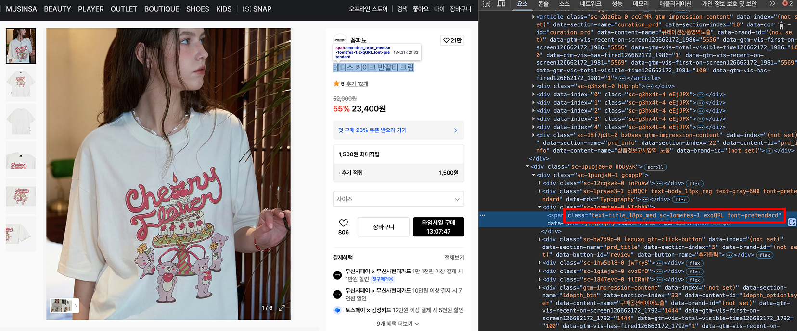
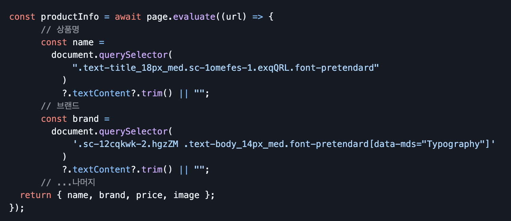
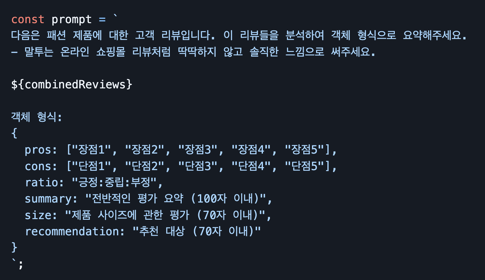
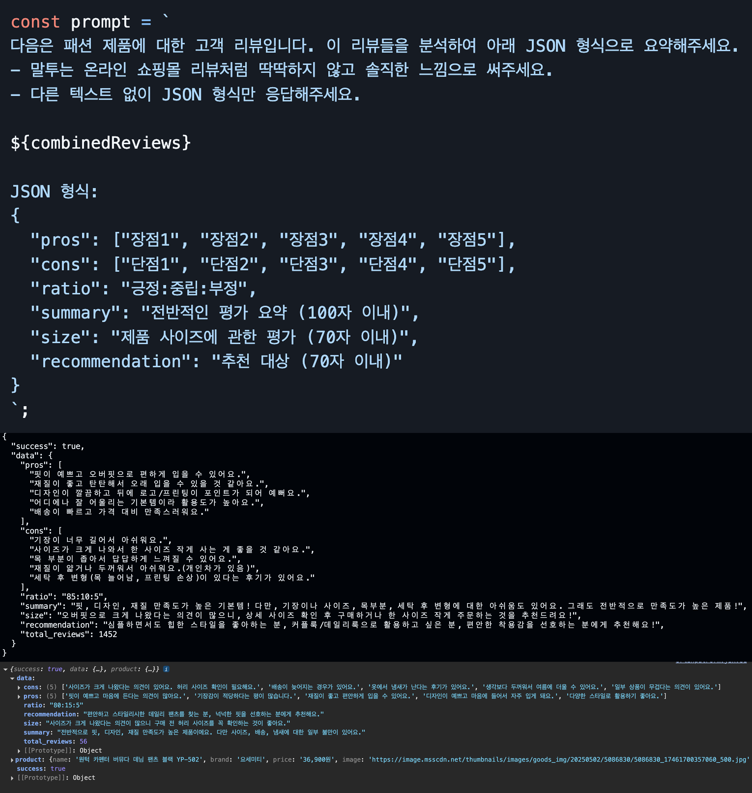

# MITGOSA(믿고사) - AI 리뷰 요약 서비스

 
 

  <strong>
  MITGOSA는 수많은 리뷰를 보며 많은 시간을 보내는 사람들을 위해,  원하는 상품의 전체 리뷰를 AI가 분석하여 한눈에 요약해주는 서비스입니다.
  </strong>
 
<a href="https://mitgosa.vercel.app">
    🔗 [https://mitgosa.vercel.app] 방문하기
</a>

 
 
 

# 🗂 목차

1. [💭 프로젝트 동기](#-프로젝트-동기)
2. [🛠 사용 기술](#-사용-기술)
3. [👀 미리보기 및 아키텍처](#-미리보기-및-아키텍처)
4. [🔥 주요 경험](#-주요-경험)
5. [💡 프로젝트 후기](#-프로젝트-후기)

 
 
 

# 💭 프로젝트 동기

이 프로젝트는 **인터넷 쇼핑을 좀 더 빠르고 편리하게** 돕고자 하는 생각에서 출발하였습니다.

온라인 마켓을 통해 쇼핑하며, 신뢰할 수 있는 정보를 얻기 위해 **수많은 리뷰를 하나하나 읽는 과정의 불편함**을 느꼈습니다. 저와 같은 사람들을 위해,  크롤링하여 얻은 리뷰 데이터를 **AI가 요약하고 정리**해줌으로써 사용자의 **시간과 노력을 획기적으로 절약**할 수 있을 것이라는 확신을 가지고 이 프로젝트를 시작하게 되었습니다.

저의 필요에서 비롯된 아이디어이기에 더 큰 애정을 가지고 개발에 임했으며, 그 속에 **기술적 도전을** 하나하나 달성하며 흥미를 느낄 수 있었습니다.

 
 
 

# 🛠 사용 기술

| 구분              | 기술                                                                                                                                                                                                                                                                                                                                                                                                            |
| ----------------- | --------------------------------------------------------------------------------------------------------------------------------------------------------------------------------------------------------------------------------------------------------------------------------------------------------------------------------------------------------------------------------------------------------------- |
| **Frontend**      |      |
| **Backend**       |                                                                                                                                                                                                     |

 
 
 

  # 👀 미리보기 및 아키텍처
  
  <table>
    <tr align="center">
      <td>리뷰 분석</td>
      <td>UI / UX</td>
    </tr>
    <tr>
       <td width="50%">
        
      </td>
      <td width="50%">
        
      </td>
    </tr>
  </table>

  ---
  
  

---

1.  **상품페이지 URL 수집:** 사용자가 상품 URL을 입력하면, 이를 서버로 전송합니다.
2.  **웹 크롤링:** 전달받은 URL을 `Puppeteer`를 이용해 크롤링하여 쇼핑몰의 리뷰 데이터를 수집합니다.
3.  **AI 리뷰 분석:** `Google Gemini API`를 활용하여 수집된 수백, 수천 개의 리뷰 텍스트를 분석하고 핵심적인 장점과 단점을 추출합니다.
4.  **Rest API 응답:** 분석된 결과(장점, 단점, 요약 등)를 클라이언트로 전달합니다.
5.  **분석 결과 시각화:** 분석된 결과를 바탕으로 상품의 장점, 단점, 종합 평점, 추천 대상까지 한눈에 보기 쉽게 제공합니다.

 

> **요약: 상품 URL 수집 >>>>>> 해당 상품의 리뷰 분석 결과 제공**

 
 
 

# 🔥 주요 경험

## [주요경험] 1. 크롤링을 사용한 필수 데이터 확보

> 크롤링(Crawling) = 웹 페이지의 데이터를 자동으로 가져오는 기술

이 프로젝트에서 중요한 데이터는 해당 상품의 리뷰 데이터와 상품 정보(상품명, 가격, 이미지 등) 입니다.  
때문에, 이 2가지 데이터를 가져오는 방법에 대한 고민을 가장 먼저 시작했고 크롤링을 사용해 데이터를 가져왔습니다.

크롤링을 통한 데이터는 공식적으로 제공되는 데이터가 아니기 때문에 신뢰성 검증이 필요했습니다.

> 본 프로젝트에서 신뢰성의 기준은 크롤링으로 수집한 리뷰 데이터의 개수가 실제 총 리뷰 개수와 얼마나 일치하는지로 설정했습니다.

---

#### 1-1. 크롤링 사용 이유 : 오픈 API의 부재

웹 페이지 데이터를 활용하는 프로젝트 특성상 오픈 API 사용을 최우선으로 고려했습니다. 
그러나 무신사, 에이블리 등의 쇼핑몰 사이트는 오픈 API를 제공하지 않아 크롤링 도입이 필요하다고 판단했습니다.

오픈 API와 크롤링을 비교할 때 가장 중요한 차이점은 **데이터의 신뢰성**입니다. 크롤링을 통한 데이터는 공식적으로 제공되는 데이터가 아니기 때문에 신뢰성 검증이 필요했습니다.

---

#### 1-2. 상품의 기본 정보 크롤링

리뷰 데이터 수집에 앞서 상품 페이지에서 기본 정보를 수집하는 과정이 필요했습니다.
 페이지의 DOM 구조를 분석한 결과, 각 상품 정보 요소들이 고유한 CSS Selector를 가지고 있음을 확인했습니다.

위 이미지의 빨간색으로 표시된 부분은 상품명이 담긴 `span` 태그의 class 속성을 보여줍니다.
 이와 같은 고유 선택자를 활용하여 상품명, 브랜드, 가격, 대표 이미지 총 4개의 핵심 정보를 안정적으로 수집할 수 있었습니다.

---

#### 1-3. 가상 스크롤 크롤링 문제 : Puppeteer의 기능을 활용한 단계적 스크롤 로직 구현

초기에 크롤링 로직으로 리뷰를 수집한 결과, 10-20개 정도 소수의 리뷰만 수집되는 문제가 발생했습니다.  
개발자 도구를 분석한 결과, 초기에 예상했던 무한스크롤 방식이 아닌 **가상 스크롤(Virtual Scroll) 방식**으로 리뷰를 렌더링하고 있었습니다.

> **가상 스크롤: 사용자가 스크롤할 때마다 새로운 데이터를 동적으로 로드하는 방식.**

무신사의 경우 순차적으로 한 번에 20-25개 정도의 리뷰만 렌더링됩니다. 이는 한 번의 크롤링으로 모든 리뷰를 수집할 수 없음을 의미했습니다.
  따라서 `page.waitForSelector()`와 `page.evaluate()`메서드를 활용하여 **단계적 스크롤 → 로딩 대기 → 데이터 수집**을 반복하였습니다.

이 후, 실제 리뷰 총 개수 대비 약 95-98%의 리뷰를 성공적으로 수집할 수 있었습니다.
 소량의 누락은 네트워크 지연이나 동적 로딩 타이밍 이슈로 인한 것으로 생각되었으나, 분석 속도와의 균형을 고려하여 만족할 만한 결과라고 판단했습니다.
 
다음은 위 내용을 토대로 진행한 테스트의 결과입니다.

[ 수집률 테스트 ]

 
 
 

## [주요경험] 2. Gemini API 프롬프트를 설계와 응답 데이터 관리

> 프롬프트(Prompt) =  AI에게 원하는 작업을 지시하기 위해 입력하는 명령문, 질문, 텍스트를 말한다.

수집된 리뷰 데이터를 의미 있는 인사이트로 변환하기 위해 Google Gemini API를 활용했습니다.
 단순히 API를 호출하는 것을 넘어, 효과적인 프롬프트 엔지니어링과 안정적인 응답 데이터 처리가 핵심 과제였습니다.

---

#### 2-1. 프롬프트 설계: 구조화된 JSON 응답 확보

리뷰 분석 결과 UI 구성을 위해 다음 6가지 (`장점`, `단점`, `긍정 부정 비율`, `전반적인 평가`, `사이즈 평가`, `추천 대상`) 데이터가 필요했습니다.

각 필드별 명확한 형식(배열, 문자열, 글자수 제한)을 지정하였고, 친근한 말투를 요청하여 사용자 경험을 고려하였습니다.

---

#### 2-2. 응답 데이터: 구조화된 JSON 응답 확보
분석 결과를 일관된 형식의 JSON 데이터로 클라이언트에 전달하는 구조 설계가 필요했습니다.

REST API 통신 환경에서는 분석 결과 역시 JSON으로 전달되어야 했기 때문에, 별도로 파싱 로직을 구성하기보다는 프롬프트에서 직접 JSON 형식으로 응답을 생성하도록 설계했습니다.
 결과적으로 개발 효율성과 응답 데이터의 일관성을 동시에 확보할 수 있는 효과적인 접근이었고, 정형화된 JSON 데이터를 안정적으로 받을 수 있었습니다.

| 서버 응답 로그 (백엔드 콘솔) | 클라이언트 수신 로그 (브라우저 콘솔) |
| ------------------------------| --------------------------- |
|  |  |

 
 
 

# 💡 프로젝트 후기

- **비동기 처리와 에러 핸들링:** 크롤링과 외부 API 통신 과정에서 발생하는 다양한 비동기 작업을 효과적으로 제어하고, 예외 상황에 대한 안정적인 에러 처리 로직을 구축하며 Node.js의 비동기 처리 모델에 대한 깊은 이해를 얻을 수 있었습니다.
- **동적 웹 크롤링의 이해:** SPA(Single Page Application)로 구성된 최신 웹사이트의 구조를 분석하고, `Puppeteer`를 통해 JavaScript가 렌더링된 후의 최종 DOM에 접근하여 원하는 데이터를 정확히 수집하는 기술적 역량을 길렀습니다.
- **LLM(거대 언어 모델) 활용 능력:** `Gemini`와 같은 강력한 AI 모델을 활용하여 비정형 텍스트 데이터를 정제하고, 의미 있는 정보(장점, 단점, 요약)를 추출하는 방법을 학습했습니다. 단순히 API를 호출하는 것을 넘어, 원하는 결과물을 얻기 위한 효과적인 프롬프트 엔지니어링의 중요성을 깨달았습니다.

 
 
 
 
 
 
